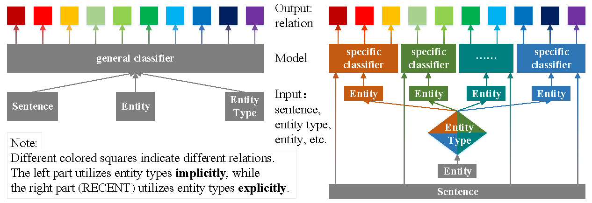

RECENT: Relation Classification with Entity Type Restriction
==========

This paper/code introduces the RECENT paradigm with Graph Convolutional Network (GCN) for the large scale sentence-level relation extraction task (TACRED).

You can find the paper [here](https://aclanthology.org/2021.findings-acl.34/)

See below for an overview of the paradigm:



# RECENT<sub>GCN</sub>
## Requirements
Our model was trained on Nvidia GTX 1080Ti graphic cards.
- Python 3 (tested on 3.7.6)
- Pytorch (tested on 1.2.0)
- CUDA （tested on 10.2.89）
- tqdm
- yaml
- unzip, wget (for downloading only)

There is no guarantee that the model is the same as we released and reported if you run the code on different environments (including hardware and software). 

## Preparation

The code requires that you have access to the TACRED dataset (LDC license required). Once you have the TACRED data, please put the JSON files under the directory `gcn-multiple/dataset/tacred` and `gcn-binary/dataset/tacred`.

First, prepare data for RECENT, 

```
cd gcn-multiple
python prepare_data.py 
```

Then, download and unzip GloVe vectors:

```
chmod +x download.sh; ./download.sh
```

Then prepare vocabulary and initial word vectors with:

```
python prepare_vocab.py dataset/tacred dataset/vocab --glove_dir dataset/glove
```

This will write vocabulary and word vectors as a numpy matrix into the dir `dataset/vocab`.
```
cp -r dataset/vocab/ ../gcn-binary/dataset/
```


## Training

First, To train a GCN multiclass model, run:

```
bash para.train.sh 1 
```

Then, To train a GCN binary model, run:

```
cd ../gcn-binary
bash train.sh 1
```

Model checkpoints and logs will be saved to `saved_models/1`.

For details on the use of other parameters, please refer to `train.py`.

## Evaluation

First, evaluate the trained binary model under the dir gcn-binary/saved_models/1. To run evaluation on the test set, run:
```
python eval.py saved_models/1 --dataset test
```

sencond, evaluate the trained multiple model under the dir saved_models/1. To run evaluation on the test set, run:
```
cd gcn-multiple
bash para.eval.sh
```

Third, set up gcn-multiple/[recent.eval.yml] ()
```
binary_id: 1
multiple_id: 1
```

Final, evaluate the GCN under the paradigm RECENT, RECENT<sub>GCN</sub>:

```
python recent_eval.py
```

## Related Repo

Codes are adapted from the repo of the EMNLP18 paper [Graph Convolution over Pruned Dependency Trees Improves Relation Extraction](https://nlp.stanford.edu/pubs/zhang2018graph.pdf).

# RECENT<sub>SpanBERT</sub>
## Requirements
Our model was trained on Nvidia GTX 1080Ti graphic cards.
- Python 3 (tested on 3.7.6)
- Pytorch (tested on 1.2.0)
- CUDA （tested on 10.2.89）
- yaml
- Apex Please use an earlier commit of Apex - [NVIDIA/apex@4a8c4ac](https://github.com/NVIDIA/apex/commit/4a8c4ac088b6f84a10569ee89db3a938b48922b4)

## Preparation

The code requires that you have access to the TACRED dataset (LDC license required). Once you have the TACRED data, please put the JSON files under the directory `SpanBERT/dataset/tacred`.

First, prepare data for RECENT, 

```
cd SpanBERT
python prepare_data.py 
```

Then, download SpanBERT large from HuggingFace:

```
chmod +x download.sh; ./download.sh
```

## Training

First, To train a SpanBERT multiclass model, run:

```
cd SpanBERT
bash bash para.train.sh
```

Then, To train a SpanBERT binary model, run:

```
bash binary_train.sh
```

Model checkpoints will be saved to `saved_models/`.

## Evaluation


Final, evaluate the SpanBERT under the paradigm RECENT, RECENT<sub>SpanBERT</sub>:

```
python recent_eval.py
```

## Related Repo

Codes are adapted from the repo of the TACL 2020 paper [SpanBERT: Improving Pre-training by Representing and Predicting Spans](https://www.aclweb.org/anthology/2020.tacl-1.5/).

## Citation
@inproceedings{lyu-chen-2021-relation,  
&nbsp;&nbsp;&nbsp; title = "Relation Classification with Entity Type Restriction",  
&nbsp;&nbsp;&nbsp; author = "Lyu, Shengfei  and Chen, Huanhuan",  
&nbsp;&nbsp;&nbsp; booktitle = "Findings of the Association for Computational Linguistics: ACL-IJCNLP 2021",  
&nbsp;&nbsp;&nbsp; month = aug,  
&nbsp;&nbsp;&nbsp; year = "2021",  
&nbsp;&nbsp;&nbsp; address = "Online",  
&nbsp;&nbsp;&nbsp; publisher = "Association for Computational Linguistics",  
&nbsp;&nbsp;&nbsp; url = "https://aclanthology.org/2021.findings-acl.34",  
&nbsp;&nbsp;&nbsp; doi = "10.18653/v1/2021.findings-acl.34",  
&nbsp;&nbsp;&nbsp; pages = "390--395",  
}